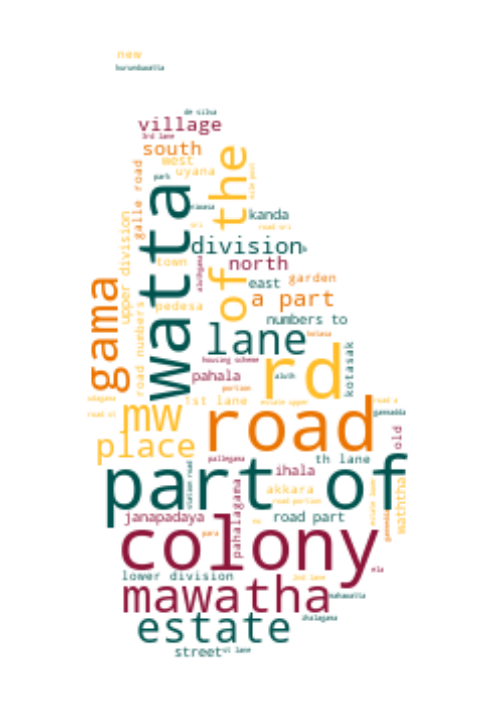

# Villages of Sri Lanka

Scrapes information about villages from http://moha.gov.lk:8090.

**52,488** Villages from **13,992** GNDs in **339** DSDs (7.973MB), scraped as of *2023-12-04 11:17:13*.

## LK-1 - Western

### LK-11 - Colombo

* [LK-1103](data/villages/LK-1103.json) - Colombo
* [LK-1106](data/villages/LK-1106.json) - Kolonnawa
* [LK-1109](data/villages/LK-1109.json) - Kaduwela
* [LK-1112](data/villages/LK-1112.json) - Homagama
* [LK-1115](data/villages/LK-1115.json) - Seethawaka
* [LK-1118](data/villages/LK-1118.json) - Padukka
* [LK-1121](data/villages/LK-1121.json) - Maharagama
* [LK-1124](data/villages/LK-1124.json) - Sri Jayawardanapura Kotte
* [LK-1127](data/villages/LK-1127.json) - Thimbirigasyaya
* [LK-1130](data/villages/LK-1130.json) - Dehiwala
* [LK-1131](data/villages/LK-1131.json) - Ratmalana
* [LK-1133](data/villages/LK-1133.json) - Moratuwa
* [LK-1136](data/villages/LK-1136.json) - Kesbewa

### LK-12 - Gampaha

* [LK-1203](data/villages/LK-1203.json) - Negombo
* [LK-1206](data/villages/LK-1206.json) - Katana
* [LK-1209](data/villages/LK-1209.json) - Divulapitiya
* [LK-1212](data/villages/LK-1212.json) - Mirigama
* [LK-1215](data/villages/LK-1215.json) - Minuwangoda
* [LK-1218](data/villages/LK-1218.json) - Wattala
* [LK-1221](data/villages/LK-1221.json) - Ja-Ela
* [LK-1224](data/villages/LK-1224.json) - Gampaha
* [LK-1227](data/villages/LK-1227.json) - Attanagalla
* [LK-1230](data/villages/LK-1230.json) - Dompe
* [LK-1233](data/villages/LK-1233.json) - Mahara
* [LK-1236](data/villages/LK-1236.json) - Kelaniya
* [LK-1239](data/villages/LK-1239.json) - Biyagama

### LK-13 - Kalutara

* [LK-1303](data/villages/LK-1303.json) - Panadura
* [LK-1306](data/villages/LK-1306.json) - Bandaragama
* [LK-1309](data/villages/LK-1309.json) - Horana
* [LK-1310](data/villages/LK-1310.json) - Ingiriya
* [LK-1312](data/villages/LK-1312.json) - Bulathsinhala
* [LK-1315](data/villages/LK-1315.json) - Madurawala
* [LK-1318](data/villages/LK-1318.json) - Millaniya
* [LK-1321](data/villages/LK-1321.json) - Kalutara
* [LK-1324](data/villages/LK-1324.json) - Beruwala
* [LK-1327](data/villages/LK-1327.json) - Dodangoda
* [LK-1330](data/villages/LK-1330.json) - Mathugama
* [LK-1333](data/villages/LK-1333.json) - Agalawatta
* [LK-1336](data/villages/LK-1336.json) - Palindanuwara
* [LK-1339](data/villages/LK-1339.json) - Walallavita

## LK-2 - Central

### LK-21 - Kandy

* [LK-2103](data/villages/LK-2103.json) - Thumpane
* [LK-2106](data/villages/LK-2106.json) - Pujapitiya
* [LK-2109](data/villages/LK-2109.json) - Akurana
* [LK-2112](data/villages/LK-2112.json) - Pathadumbara
* [LK-2115](data/villages/LK-2115.json) - Panvila
* [LK-2118](data/villages/LK-2118.json) - Udadumbara
* [LK-2121](data/villages/LK-2121.json) - Minipe
* [LK-2124](data/villages/LK-2124.json) - Medadumbara
* [LK-2127](data/villages/LK-2127.json) - Kundasale
* [LK-2130](data/villages/LK-2130.json) - Kandy Four Gravets & Gangawata Korale
* [LK-2133](data/villages/LK-2133.json) - Harispattuwa
* [LK-2134](data/villages/LK-2134.json) - Hatharaliyadda
* [LK-2136](data/villages/LK-2136.json) - Yatinuwara
* [LK-2139](data/villages/LK-2139.json) - Udunuwara
* [LK-2142](data/villages/LK-2142.json) - Doluwa
* [LK-2145](data/villages/LK-2145.json) - Pathahewaheta
* [LK-2148](data/villages/LK-2148.json) - Deltota
* [LK-2151](data/villages/LK-2151.json) - Udapalatha
* [LK-2154](data/villages/LK-2154.json) - Ganga Ihala Korale
* [LK-2157](data/villages/LK-2157.json) - Pasbage Korale

### LK-22 - Matale

* [LK-2203](data/villages/LK-2203.json) - Galewela
* [LK-2206](data/villages/LK-2206.json) - Dambulla
* [LK-2209](data/villages/LK-2209.json) - Naula
* [LK-2212](data/villages/LK-2212.json) - Pallepola
* [LK-2215](data/villages/LK-2215.json) - Yatawatta
* [LK-2218](data/villages/LK-2218.json) - Matale
* [LK-2221](data/villages/LK-2221.json) - Ambanganga Korale
* [LK-2224](data/villages/LK-2224.json) - Laggala-Pallegama
* [LK-2227](data/villages/LK-2227.json) - Wilgamuwa
* [LK-2230](data/villages/LK-2230.json) - Rattota
* [LK-2233](data/villages/LK-2233.json) - Ukuwela

### LK-23 - Nuwara Eliya

* [LK-2303](data/villages/LK-2303.json) - Kothmale
* [LK-2304](data/villages/LK-2304.json) - ❔
* [LK-2306](data/villages/LK-2306.json) - Hanguranketha
* [LK-2307](data/villages/LK-2307.json) - ❔
* [LK-2309](data/villages/LK-2309.json) - Walapane
* [LK-2310](data/villages/LK-2310.json) - ❔
* [LK-2312](data/villages/LK-2312.json) - Nuwara Eliya
* [LK-2313](data/villages/LK-2313.json) - ❔
* [LK-2315](data/villages/LK-2315.json) - Ambagamuwa
* [LK-2316](data/villages/LK-2316.json) - ❔

## LK-3 - Southern

### LK-31 - Galle

* [LK-3103](data/villages/LK-3103.json) - Bentota
* [LK-3106](data/villages/LK-3106.json) - Balapitiya
* [LK-3109](data/villages/LK-3109.json) - Karandeniya
* [LK-3112](data/villages/LK-3112.json) - Elpitiya
* [LK-3115](data/villages/LK-3115.json) - Niyagama
* [LK-3118](data/villages/LK-3118.json) - Thawalama
* [LK-3121](data/villages/LK-3121.json) - Neluwa
* [LK-3124](data/villages/LK-3124.json) - Nagoda
* [LK-3127](data/villages/LK-3127.json) - Baddegama
* [LK-3128](data/villages/LK-3128.json) - ❔
* [LK-3130](data/villages/LK-3130.json) - Welivitiya-Divithura
* [LK-3133](data/villages/LK-3133.json) - Ambalangoda
* [LK-3136](data/villages/LK-3136.json) - Hikkaduwa
* [LK-3137](data/villages/LK-3137.json) - ❔
* [LK-3138](data/villages/LK-3138.json) - ❔
* [LK-3139](data/villages/LK-3139.json) - Galle Four Gravets
* [LK-3142](data/villages/LK-3142.json) - Bope-Poddala
* [LK-3145](data/villages/LK-3145.json) - Akmeemana
* [LK-3148](data/villages/LK-3148.json) - Yakkalamulla
* [LK-3151](data/villages/LK-3151.json) - Imaduwa
* [LK-3154](data/villages/LK-3154.json) - Habaraduwa
* [LK-3157](data/villages/LK-3157.json) - ❔

### LK-32 - Matara

* [LK-3203](data/villages/LK-3203.json) - Pitabeddara
* [LK-3206](data/villages/LK-3206.json) - Kotapola
* [LK-3209](data/villages/LK-3209.json) - Pasgoda
* [LK-3212](data/villages/LK-3212.json) - Mulatiyana
* [LK-3215](data/villages/LK-3215.json) - Athuraliya
* [LK-3218](data/villages/LK-3218.json) - Akuressa
* [LK-3221](data/villages/LK-3221.json) - Welipitiya
* [LK-3224](data/villages/LK-3224.json) - Malimbada
* [LK-3227](data/villages/LK-3227.json) - Kamburupitiya
* [LK-3230](data/villages/LK-3230.json) - Hakmana
* [LK-3233](data/villages/LK-3233.json) - Kirinda Puhulwella
* [LK-3236](data/villages/LK-3236.json) - Thihagoda
* [LK-3239](data/villages/LK-3239.json) - Weligama
* [LK-3242](data/villages/LK-3242.json) - Matara Four Gravets
* [LK-3245](data/villages/LK-3245.json) - Devinuwara
* [LK-3248](data/villages/LK-3248.json) - Dickwella

### LK-33 - Hambantota

* [LK-3303](data/villages/LK-3303.json) - Sooriyawewa
* [LK-3306](data/villages/LK-3306.json) - Lunugamvehera
* [LK-3309](data/villages/LK-3309.json) - Thissamaharama
* [LK-3312](data/villages/LK-3312.json) - Hambantota
* [LK-3315](data/villages/LK-3315.json) - Ambalantota
* [LK-3318](data/villages/LK-3318.json) - Angunakolapelessa
* [LK-3321](data/villages/LK-3321.json) - Weeraketiya
* [LK-3324](data/villages/LK-3324.json) - Katuwana
* [LK-3327](data/villages/LK-3327.json) - Okewela
* [LK-3330](data/villages/LK-3330.json) - Beliatta
* [LK-3333](data/villages/LK-3333.json) - Tangalle
* [LK-3336](data/villages/LK-3336.json) - ❔

## LK-4 - Northern

### LK-41 - Jaffna

* [LK-4103](data/villages/LK-4103.json) - Island North (Kayts)
* [LK-4106](data/villages/LK-4106.json) - Valikamam West (Chankanai)
* [LK-4109](data/villages/LK-4109.json) - Valikamam South-West (Sandilipay)
* [LK-4112](data/villages/LK-4112.json) - Valikamam North (Tellipallai)
* [LK-4115](data/villages/LK-4115.json) - Valikamam South (Uduvil)
* [LK-4118](data/villages/LK-4118.json) - Valikamam East (Kopay)
* [LK-4121](data/villages/LK-4121.json) - Vadamaradchi South-West (Karaveddy)
* [LK-4124](data/villages/LK-4124.json) - Vadamaradchi East
* [LK-4127](data/villages/LK-4127.json) - Vadamaradchi North (Point Pedro)
* [LK-4130](data/villages/LK-4130.json) - Thenmaradchi (Chavakachcheri)
* [LK-4133](data/villages/LK-4133.json) - Nallur
* [LK-4136](data/villages/LK-4136.json) - Jaffna
* [LK-4139](data/villages/LK-4139.json) - Island South (Velanai)
* [LK-4142](data/villages/LK-4142.json) - Delft
* [LK-4145](data/villages/LK-4145.json) - ❔

### LK-42 - Mannar

* [LK-4203](data/villages/LK-4203.json) - Mannar Town
* [LK-4206](data/villages/LK-4206.json) - Manthai West
* [LK-4209](data/villages/LK-4209.json) - Madhu
* [LK-4212](data/villages/LK-4212.json) - Nanattan
* [LK-4215](data/villages/LK-4215.json) - Musali

### LK-43 - Vavuniya

* [LK-4303](data/villages/LK-4303.json) - Vavuniya North
* [LK-4306](data/villages/LK-4306.json) - Vavuniya South
* [LK-4309](data/villages/LK-4309.json) - Vavuniya
* [LK-4312](data/villages/LK-4312.json) - Vengalacheddikulam

### LK-44 - Mullaitivu

* [LK-4403](data/villages/LK-4403.json) - Thunukkai
* [LK-4406](data/villages/LK-4406.json) - Manthai East
* [LK-4409](data/villages/LK-4409.json) - Puthukkudiyiruppu
* [LK-4412](data/villages/LK-4412.json) - Oddusuddan
* [LK-4415](data/villages/LK-4415.json) - Maritimepattu
* [LK-4418](data/villages/LK-4418.json) - Welioya

### LK-45 - Kilinochchi

* [LK-4503](data/villages/LK-4503.json) - Pachchilaipalli
* [LK-4506](data/villages/LK-4506.json) - Kandavalai
* [LK-4509](data/villages/LK-4509.json) - Karachchi
* [LK-4512](data/villages/LK-4512.json) - Poonakary

## LK-5 - Eastern

### LK-51 - Batticaloa

* [LK-5103](data/villages/LK-5103.json) - Koralai Pattu North (Vaharai)
* [LK-5106](data/villages/LK-5106.json) - Koralai Pattu  West (Oddamavadi)
* [LK-5109](data/villages/LK-5109.json) - Koralai Pattu (Valachchenai)
* [LK-5112](data/villages/LK-5112.json) - Eravur Pattu
* [LK-5115](data/villages/LK-5115.json) - Eravur Town
* [LK-5118](data/villages/LK-5118.json) - Manmunai North
* [LK-5121](data/villages/LK-5121.json) - Manmunai West
* [LK-5124](data/villages/LK-5124.json) - Kattankudy
* [LK-5127](data/villages/LK-5127.json) - Manmunai Pattu (Araipattai)
* [LK-5130](data/villages/LK-5130.json) - Manmunai South-West
* [LK-5133](data/villages/LK-5133.json) - Porativu Pattu
* [LK-5136](data/villages/LK-5136.json) - Manmunai South & Eruvil pattu
* [LK-5139](data/villages/LK-5139.json) - ❔
* [LK-5142](data/villages/LK-5142.json) - ❔

### LK-52 - Ampara

* [LK-5203](data/villages/LK-5203.json) - Dehiattakandiya
* [LK-5206](data/villages/LK-5206.json) - Padiyathalawa
* [LK-5209](data/villages/LK-5209.json) - Mahaoya
* [LK-5212](data/villages/LK-5212.json) - Uhana
* [LK-5215](data/villages/LK-5215.json) - Ampara
* [LK-5216](data/villages/LK-5216.json) - Navithanveli
* [LK-5218](data/villages/LK-5218.json) - Samanthurai
* [LK-5224](data/villages/LK-5224.json) - Kalmunai
* [LK-5225](data/villages/LK-5225.json) - Sainthamaruthu
* [LK-5227](data/villages/LK-5227.json) - Karaitheevu
* [LK-5230](data/villages/LK-5230.json) - Ninthavur
* [LK-5233](data/villages/LK-5233.json) - Addalachchenai
* [LK-5234](data/villages/LK-5234.json) - Irakkamam
* [LK-5236](data/villages/LK-5236.json) - Akkaraipattu
* [LK-5239](data/villages/LK-5239.json) - Alayadiwembu
* [LK-5242](data/villages/LK-5242.json) - Damana
* [LK-5245](data/villages/LK-5245.json) - Thirukkovil
* [LK-5248](data/villages/LK-5248.json) - Pothuvil
* [LK-5251](data/villages/LK-5251.json) - Lahugala

### LK-53 - Trincomalee

* [LK-5303](data/villages/LK-5303.json) - Padavi Sri Pura
* [LK-5306](data/villages/LK-5306.json) - Kuchchaveli
* [LK-5309](data/villages/LK-5309.json) - Gomarankadawala
* [LK-5312](data/villages/LK-5312.json) - Morawewa
* [LK-5315](data/villages/LK-5315.json) - Trincomalee Town and Gravets
* [LK-5318](data/villages/LK-5318.json) - Thambalagamuwa
* [LK-5321](data/villages/LK-5321.json) - Kanthale
* [LK-5324](data/villages/LK-5324.json) - Kinniya
* [LK-5327](data/villages/LK-5327.json) - Muttur
* [LK-5330](data/villages/LK-5330.json) - Seruvila
* [LK-5333](data/villages/LK-5333.json) - Verugal (Eachchilampattu)

## LK-6 - North Western

### LK-61 - Kurunegala

* [LK-6103](data/villages/LK-6103.json) - Giribawa
* [LK-6106](data/villages/LK-6106.json) - Galgamuwa
* [LK-6109](data/villages/LK-6109.json) - Ehetuwewa
* [LK-6112](data/villages/LK-6112.json) - Ambanpola
* [LK-6115](data/villages/LK-6115.json) - Kotavehera
* [LK-6118](data/villages/LK-6118.json) - Rasnayakapura
* [LK-6121](data/villages/LK-6121.json) - Nikaweratiya
* [LK-6124](data/villages/LK-6124.json) - Maho
* [LK-6127](data/villages/LK-6127.json) - Polpithigama
* [LK-6130](data/villages/LK-6130.json) - Ibbagamuwa
* [LK-6133](data/villages/LK-6133.json) - Ganewatta
* [LK-6136](data/villages/LK-6136.json) - Wariyapola
* [LK-6139](data/villages/LK-6139.json) - Kobeigane
* [LK-6142](data/villages/LK-6142.json) - Bingiriya
* [LK-6145](data/villages/LK-6145.json) - Panduwasnuwara West
* [LK-6148](data/villages/LK-6148.json) - Panduwasnuwara East
* [LK-6149](data/villages/LK-6149.json) - Bamunakotuwa
* [LK-6151](data/villages/LK-6151.json) - Maspotha
* [LK-6154](data/villages/LK-6154.json) - Kurunegala
* [LK-6157](data/villages/LK-6157.json) - Mallawapitiya
* [LK-6160](data/villages/LK-6160.json) - Mawathagama
* [LK-6163](data/villages/LK-6163.json) - Rideegama
* [LK-6166](data/villages/LK-6166.json) - Weerambugedara
* [LK-6169](data/villages/LK-6169.json) - Kuliyapitiya East
* [LK-6172](data/villages/LK-6172.json) - Kuliyapitiya West
* [LK-6175](data/villages/LK-6175.json) - Udubaddawa
* [LK-6178](data/villages/LK-6178.json) - Pannala
* [LK-6181](data/villages/LK-6181.json) - Narammala
* [LK-6184](data/villages/LK-6184.json) - Alawwa
* [LK-6187](data/villages/LK-6187.json) - Polgahawela

### LK-62 - Puttalam

* [LK-6203](data/villages/LK-6203.json) - Kalpitiya
* [LK-6206](data/villages/LK-6206.json) - Vanathawilluwa
* [LK-6209](data/villages/LK-6209.json) - Karuwalagaswewa
* [LK-6212](data/villages/LK-6212.json) - Nawagattegama
* [LK-6215](data/villages/LK-6215.json) - Puttalam
* [LK-6218](data/villages/LK-6218.json) - Mundel
* [LK-6221](data/villages/LK-6221.json) - Mahakumbukkadawala
* [LK-6224](data/villages/LK-6224.json) - Anamaduwa
* [LK-6227](data/villages/LK-6227.json) - Pallama
* [LK-6230](data/villages/LK-6230.json) - Arachchikattuwa
* [LK-6233](data/villages/LK-6233.json) - Chilaw
* [LK-6236](data/villages/LK-6236.json) - Madampe
* [LK-6239](data/villages/LK-6239.json) - Mahawewa
* [LK-6242](data/villages/LK-6242.json) - Nattandiya
* [LK-6245](data/villages/LK-6245.json) - Wennappuwa
* [LK-6248](data/villages/LK-6248.json) - Dankotuwa

## LK-7 - North Central

### LK-71 - Anuradhapura

* [LK-7103](data/villages/LK-7103.json) - Padaviya
* [LK-7106](data/villages/LK-7106.json) - Kebithigollewa
* [LK-7109](data/villages/LK-7109.json) - Medawachchiya
* [LK-7112](data/villages/LK-7112.json) - Mahawilachchiya
* [LK-7115](data/villages/LK-7115.json) - Nuwaragam Palatha Central
* [LK-7118](data/villages/LK-7118.json) - Rambewa
* [LK-7121](data/villages/LK-7121.json) - Kahatagasdigiliya
* [LK-7124](data/villages/LK-7124.json) - Horowpothana
* [LK-7127](data/villages/LK-7127.json) - Galenbindunuwewa
* [LK-7130](data/villages/LK-7130.json) - Mihinthale
* [LK-7133](data/villages/LK-7133.json) - Nuwaragam Palatha East
* [LK-7136](data/villages/LK-7136.json) - Nachchaduwa
* [LK-7139](data/villages/LK-7139.json) - Nochchiyagama
* [LK-7142](data/villages/LK-7142.json) - Rajanganaya
* [LK-7145](data/villages/LK-7145.json) - Thambuttegama
* [LK-7148](data/villages/LK-7148.json) - Thalawa
* [LK-7151](data/villages/LK-7151.json) - Thirappane
* [LK-7154](data/villages/LK-7154.json) - Kekirawa
* [LK-7157](data/villages/LK-7157.json) - Palugaswewa
* [LK-7160](data/villages/LK-7160.json) - Ipalogama
* [LK-7163](data/villages/LK-7163.json) - Galnewa
* [LK-7166](data/villages/LK-7166.json) - Palagala

### LK-72 - Polonnaruwa

* [LK-7203](data/villages/LK-7203.json) - Hingurakgoda
* [LK-7206](data/villages/LK-7206.json) - Medirigiriya
* [LK-7209](data/villages/LK-7209.json) - Lankapura
* [LK-7210](data/villages/LK-7210.json) - Welikanda
* [LK-7212](data/villages/LK-7212.json) - Dimbulagala
* [LK-7215](data/villages/LK-7215.json) - Thamankaduwa
* [LK-7218](data/villages/LK-7218.json) - Elahera

## LK-8 - Uva

### LK-81 - Badulla

* [LK-8103](data/villages/LK-8103.json) - Mahiyanganaya
* [LK-8106](data/villages/LK-8106.json) - Rideemaliyadda
* [LK-8109](data/villages/LK-8109.json) - Meegahakivula
* [LK-8112](data/villages/LK-8112.json) - Kandaketiya
* [LK-8115](data/villages/LK-8115.json) - Soranathota
* [LK-8118](data/villages/LK-8118.json) - Passara
* [LK-8119](data/villages/LK-8119.json) - Lunugala
* [LK-8121](data/villages/LK-8121.json) - Badulla
* [LK-8124](data/villages/LK-8124.json) - Hali-Ela
* [LK-8127](data/villages/LK-8127.json) - Uva Paranagama
* [LK-8130](data/villages/LK-8130.json) - Welimada
* [LK-8133](data/villages/LK-8133.json) - Bandarawela
* [LK-8136](data/villages/LK-8136.json) - Ella
* [LK-8139](data/villages/LK-8139.json) - Haputale
* [LK-8142](data/villages/LK-8142.json) - Haldummulla

### LK-82 - Moneragala

* [LK-8203](data/villages/LK-8203.json) - Bibile
* [LK-8206](data/villages/LK-8206.json) - Madulla
* [LK-8209](data/villages/LK-8209.json) - Medagama
* [LK-8212](data/villages/LK-8212.json) - Siyambalanduwa
* [LK-8215](data/villages/LK-8215.json) - Moneragala
* [LK-8218](data/villages/LK-8218.json) - Badalkumbura
* [LK-8221](data/villages/LK-8221.json) - Wellawaya
* [LK-8224](data/villages/LK-8224.json) - Buttala
* [LK-8227](data/villages/LK-8227.json) - Katharagama
* [LK-8230](data/villages/LK-8230.json) - Thanamalvila
* [LK-8233](data/villages/LK-8233.json) - Sevanagala

## LK-9 - Sabaragamuwa

### LK-91 - Ratnapura

* [LK-9103](data/villages/LK-9103.json) - Eheliyagoda
* [LK-9106](data/villages/LK-9106.json) - Kuruvita
* [LK-9109](data/villages/LK-9109.json) - Kiriella
* [LK-9112](data/villages/LK-9112.json) - Ratnapura
* [LK-9115](data/villages/LK-9115.json) - Imbulpe
* [LK-9118](data/villages/LK-9118.json) - Balangoda
* [LK-9119](data/villages/LK-9119.json) - ❔
* [LK-9121](data/villages/LK-9121.json) - Opanayake
* [LK-9124](data/villages/LK-9124.json) - Pelmadulla
* [LK-9127](data/villages/LK-9127.json) - Elapatha
* [LK-9130](data/villages/LK-9130.json) - Ayagama
* [LK-9133](data/villages/LK-9133.json) - Kalawana
* [LK-9136](data/villages/LK-9136.json) - Nivithigala
* [LK-9139](data/villages/LK-9139.json) - Kahawatta
* [LK-9142](data/villages/LK-9142.json) - Godakawela
* [LK-9145](data/villages/LK-9145.json) - Weligepola
* [LK-9148](data/villages/LK-9148.json) - Embilipitiya
* [LK-9151](data/villages/LK-9151.json) - Kolonna

### LK-92 - Kegalle

* [LK-9203](data/villages/LK-9203.json) - Rambukkana
* [LK-9206](data/villages/LK-9206.json) - Mawanella
* [LK-9209](data/villages/LK-9209.json) - Aranayaka
* [LK-9212](data/villages/LK-9212.json) - Kegalle
* [LK-9215](data/villages/LK-9215.json) - Galigamuwa
* [LK-9218](data/villages/LK-9218.json) - Warakapola
* [LK-9221](data/villages/LK-9221.json) - Ruwanwella
* [LK-9224](data/villages/LK-9224.json) - Bulathkohupitiya
* [LK-9227](data/villages/LK-9227.json) - Yatiyanthota
* [LK-9230](data/villages/LK-9230.json) - Dehiovita
* [LK-9233](data/villages/LK-9233.json) - Deraniyagala